# Speaker Recognition System (MFCC + GMM-UBM)

## Overview
This project identifies which of eight enrolled speakers produced a given short speech segment, and reports a confidence level for the prediction.  
It combines **signal processing (MFCC feature extraction in MATLAB)** with **machine learning (GMM-UBM speaker modeling in Python)**.

---

## System Architecture

```text
Audio (.wav)
    ↓
[MATLAB – MFCC from scratch]
    preemphasis → framing → windowing → FFT → mel filterbank
    → log compression → DCT → delta computation
    ↓
39-dim features per frame (13 MFCC + 13 Δ + 13 ΔΔ)
    ↓
Exported .mat files
    ↓
[Python – GMM-UBM Engine]
    Train UBM → MAP Adapt → Score via log-likelihood ratios
    ↓
Predicted speaker + confidence %
```


---

## My Contribution 
As a **signal processing enthusiast**, I built the **entire MFCC feature extraction pipeline in MATLAB**:
- Implemented each stage: `preemphasis`, `frame_signal`, `apply_window`, `myFFT`, `MelBank`, `apply_log`, `apply_dct`, `delta`.
- Designed the **full pipeline** to take raw voice data and output a **39-dimensional MFCC matrix** (MFCC + delta + delta-delta).
- Verified correctness with spectrograms, mel filterbank plots, MFCC heatmaps, and delta patterns.
- Automated batch export of features into `.mat` files for Python training.

This contribution laid the **foundation of the project**, ensuring robust and accurate features before machine learning modeling.

---
## Simulated images of Each stage of MFCC pipeline
### 1. Audio Plot
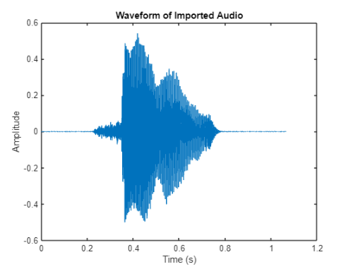

### 2. Framing
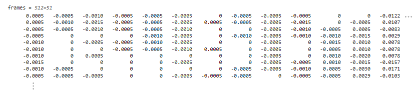

### 3. Frame Windowing
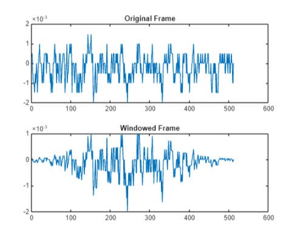
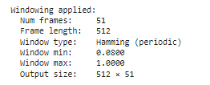

### 4. Applying FFT for windows ( one frame visualization )
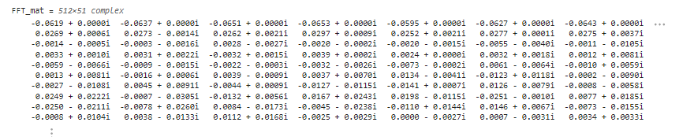

### 5. Get Absolute Values of FFT
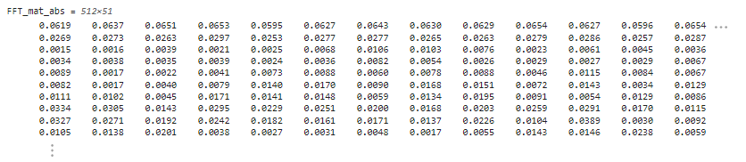

### 6. FFT Power stectrum ( one frame Visualization  )
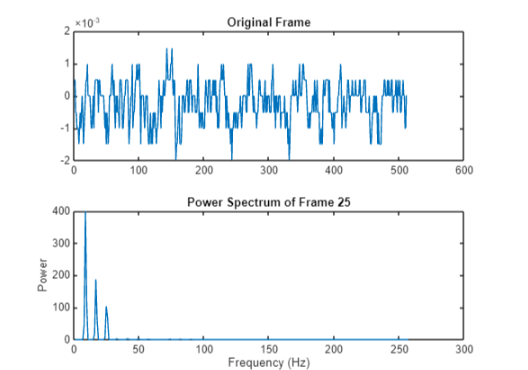

### 7. Melbank Filters
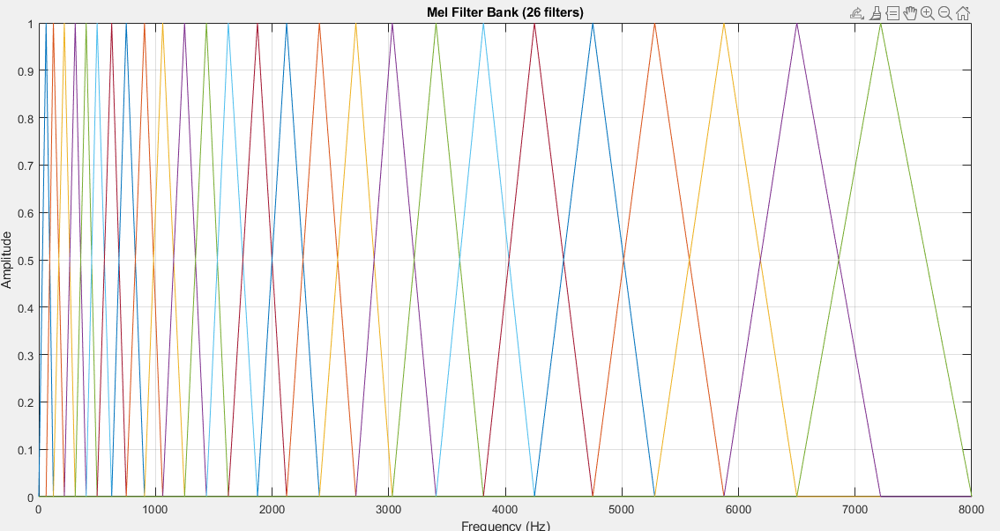

### 8. Mel Filtered FFT ( one frame Visualization )
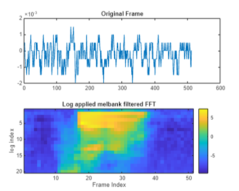

### 9. Correlation Matrix of Mel filtered FFT 
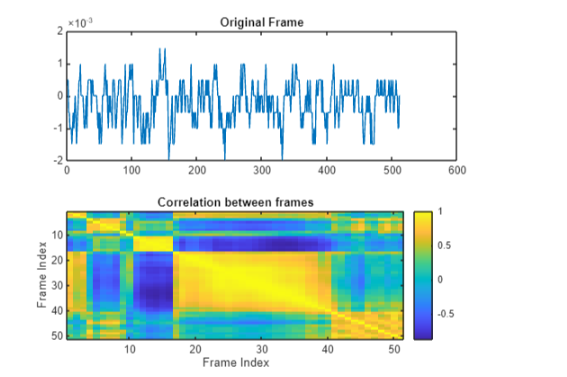

### 10. MFCC Matrix ( For Example Voice )
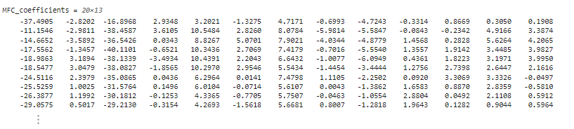

### 11. MFCC Colorbar  ( For Example Voice )
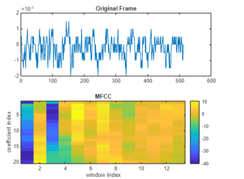

---

## Development Phases

### Phase 1 – MFCC Feature Extraction (MATLAB)
- **Pre-emphasis**: High-pass filter with α = 0.97  
- **Framing**: 256 samples per frame, hop size = 100  
- **Windowing**: Hamming window  
- **FFT & Power Spectrum**: 512-point FFT  
- **Mel Filterbank**: 26 triangular filters  
- **Log Compression**: Natural log of mel energies  
- **DCT**: First 13 coefficients retained  
- **Delta & Delta-Delta**: First and second-order differences  
- **Output**: 39-dimensional feature vector per frame

### Phase 2 – Feature Export
- Batch processed all `.wav` files in `data/train/` and `data/test/`  
- Truncated recordings to uniform length  
- Exported `.mat` files containing MFCCs, deltas, and delta-deltas  

### Phase 3 – Speaker Modelling (Python)
- **UBM Training**: GaussianMixture on pooled data  
- **MAP Adaptation**: Per-speaker adaptation with relevance factor  
- **Scoring**: Log-likelihood ratio against UBM  
- **Confidence**: Softmax calibration  

### Phase 4 – Visualization (Jupyter Notebook)
- MFCC heatmaps, PCA scatter plots, KDE distributions  
- UBM component visualization  
- MAP adaptation magnitude plots  
- Confusion matrices, ROC curves, EER/AUC computation  
- Hyperparameter grid search (UBM components: 8–64, relevance factor: 4–32)

---

## Results
- **Accuracy**: 100% identification across all 8 speakers (MATLAB-exported and librosa-extracted features).  
- **Robustness**: Nearly all hyperparameter settings achieved 100% accuracy; only a few dropped to 87.5%.  
- **EER/AUC**: Computed with ROC curves and score distributions.  

---

## File Contributions (MATLAB Signal Processing)
Screenshot of my implemented functions:
- `preemphasis.m`  
- `apply_window.m`  
- `myFFT.m`, `myFFT_2.m`  
- `MelBank.m`  
- `apply_log.m`  
- `apply_dct.m`  
- `delta.m`  
- `create_mfcc_dataset.m`  
- `Create_mfcc_dataset_modified.m`  
- `get_FFTP_Melbank_MFCC_Featurevector.m`  
- `read.m`  

These files form the **core MFCC pipeline** that powers the system.

---

## References
- Reynolds et al., *Speaker Verification Using Adapted Gaussian Mixture Models*, DSP, 2000.  
- Davis & Mermelstein, *Comparison of Parametric Representations for Word Recognition*, IEEE, 1980.  
- Gauvain & Lee, *Maximum a Posteriori Estimation for GMMs*, IEEE, 1994.
